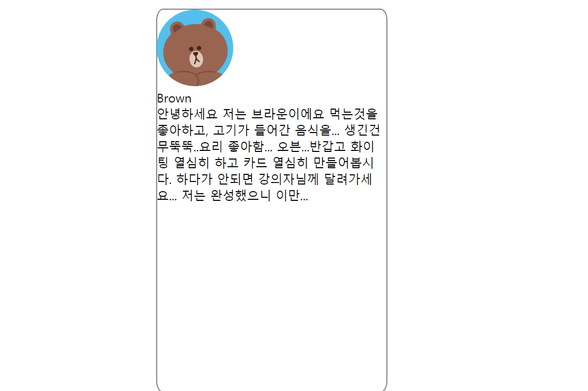
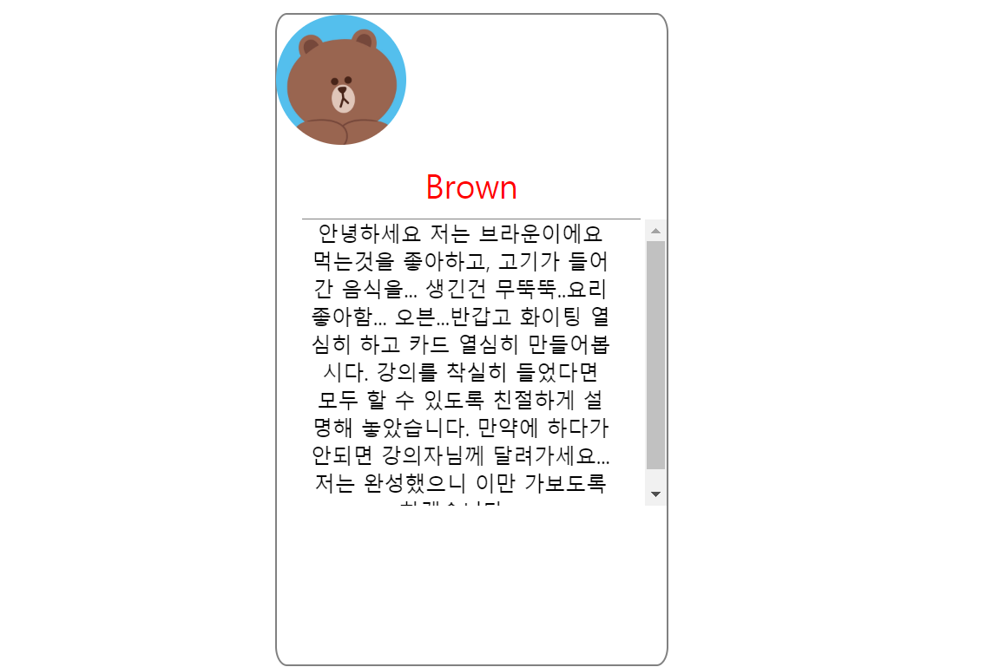
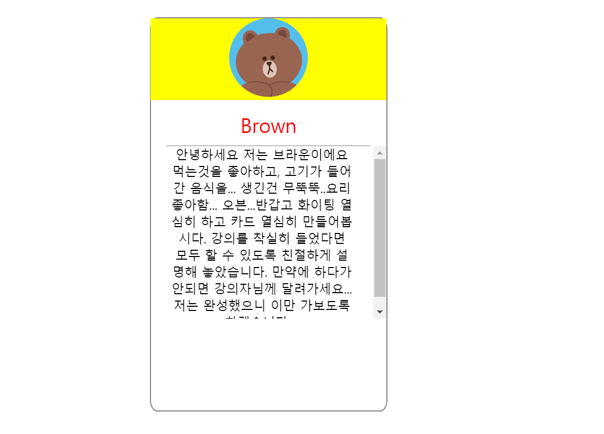
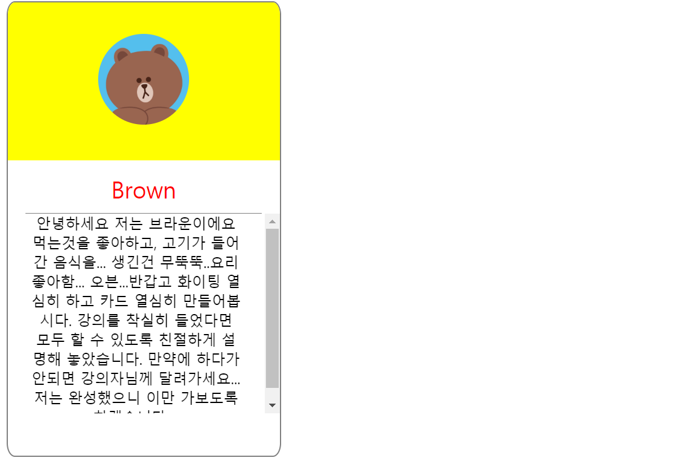
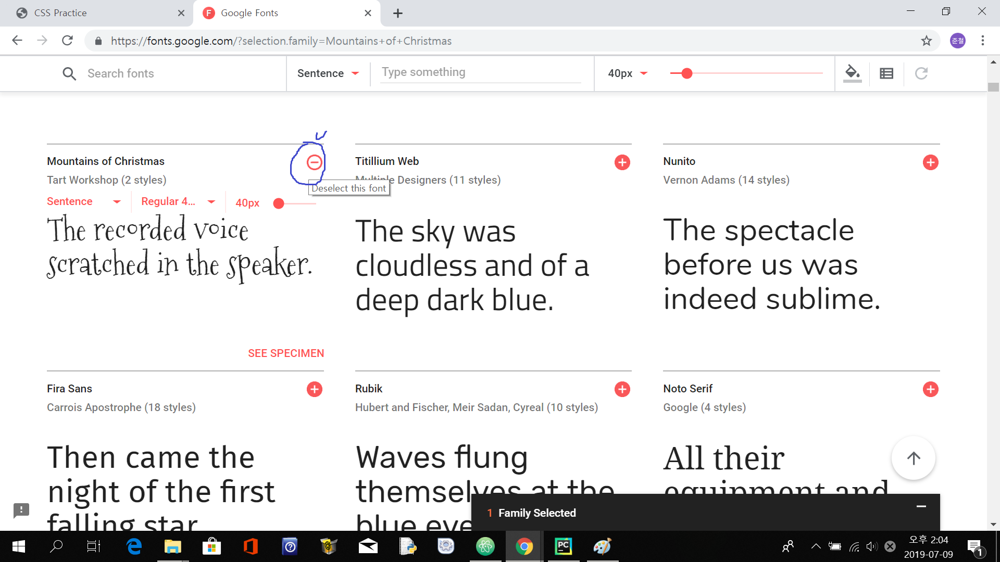
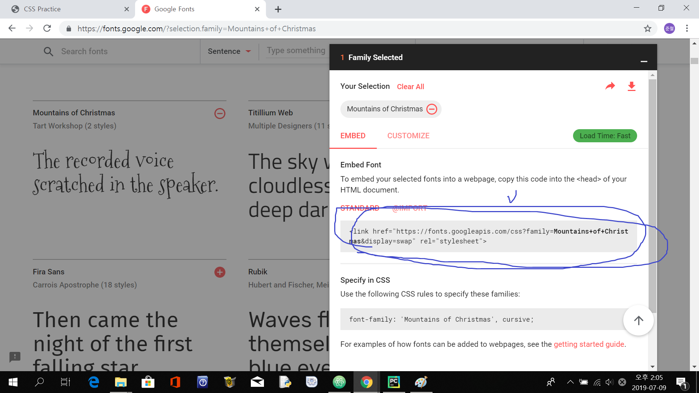
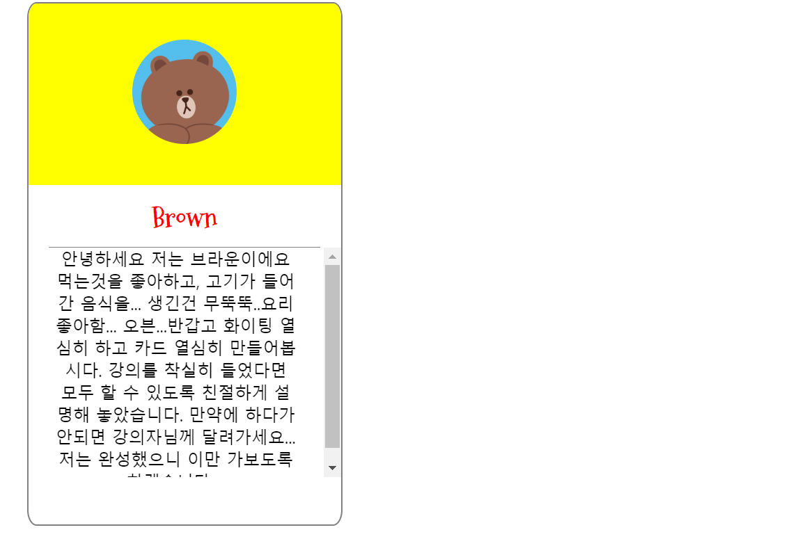
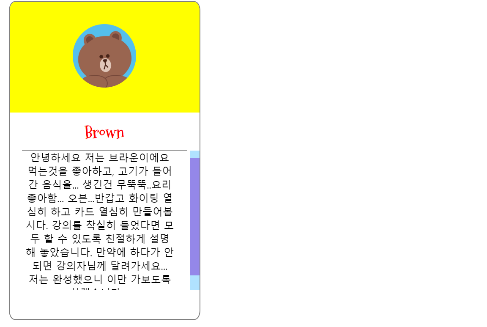

# 자기소개카드 답안  
### 1.큰 틀 잡기
일단 카드의 구성요소를 생각해봅시다.   
`카드`라는 큰 틀 안에 `프로필사진`, `이름`, `소개글`이 있는 것을 확인할 수 있죠?  
각 요소들을 `div box`로 구현해 카드를 완성해봅시다.  
```
<!DOCTYPE html>
    <head>
        <title>CSS Practice</title>
    </head>
    <body>
        <div class = "card">
            <div class = "profile_img_div">
            </div>
            <div class = "name">
            </div>
            <div class = "intro">
            </div>
        </div>
    </body>
<html>
```
이로써 카드의 큰 틀을 완성했습니다

### 2.내용 채우기
카드의 틀을 완성했으니 내용을 채워봅시다!  
저희가 채울 내용은 다음과 같습니다.
 + `프로필 사진`
 + `이름`
 + `소개글 ` 

각 내용을 해당하는 `div box`에 채워봅시다.  
프로필 사진의 경우 `img`태그를 이용하시면 되고,  
이름과 소개글의 경우 텍스트를 타이핑 하시면 됩니다.

__프로필사진 추가__
```
<div class = "profile_img_div">
    
</div>
```

__이름 추가__
```
<div class = "name">
    Brown
</div>
```

__내용 추가__
```
<div class = "intro">
    안녕하세요 저는 브라운이에요 먹는것을 좋아하고, 고기가 들어간 음식을... 생긴건 무뚝뚝..요리 좋아함... 오븐...반갑고 화이팅 열심히 하고 카드 열심히 만들어봅시다. 강의를 착실히 들었다면 모두 할 수 있도록 친절하게 설명해 놓았습니다. 만약에 하다가 안되면 강의자님께 달려가세요... 저는 완성했으니 이만 가보도록 하겠습니다....
</div>
```

### 3. `div box` 꾸미기
틀을 만들고 내용을 넣었지만 아직 카드의 형태나 색깔을 잡아주지 않았습니다.  
지금부터 카드의 형태를 가지도록 `CSS`로 꾸며봅시다!  
`CSS`를 사용하는 방법에는 여러가지가 있지만 여기선 `<head>` 태그 안에 `<style>`태그를 쓰는 방법을 사용했습니다.  

우선 가장 큰 틀인 `card`의 `div box`형태를 잡아줍시다.   
가로, 세로 크기는 `width`와 `height`로 조절하고 카드의 경계선을 `border`로 표현합니다. 그리고 `border-radius` 수치를 바꿔 박스 모서리를 둥글게 만듭니다.  
`margin: auto` 명령어로 카드를 보기 좋게 중간에 위치시킵시다.
```
<head>
    <style>
        .card{
            margin: auto;
            width:300px;
            height:500px;
            border: 1px solid gray;
            border-radius :3%;
          }
    </style>
</head>
```
 다음으로 프로필 이미지의 크기를 지정해보겠습니다.  
 가로, 세로 크기는 `width`와 `height`로 조절하고 `border-radius` 수치를 바꿔 이미지를 둥글게 만듭니다.
 ```
 <head>
    <style>
        .profile_img{
            width: 100px;
            height: 100px;
            border-radius: 50%;
        }
    </style>
 </head>
 ```
 여기까지의 과정으로 카드가 이미지와 같이 변경됨을 알 수 있습니다.  
   
 
 이제 `name`과 `intro` 박스를 손보도록 합시다.  
 
 먼저 `name`의 경우입니다.  
 `text-align: center` 명령어로 박스 안의 텍스트를 중간에 정렬할 수 있습니다.  
 `font-size`와 `color`를 통해 글자의 크기와 색깔을 원하는대로 변경합시다.  
 박스끼리의 간격이나 박스 내부 내용물의 위치는 `margin`과 `padding`을 적절히 조작하여 보기 좋게 만듭니다.  
 `border-bottom`을 이용해 `div box`의 아래쪽 경계만을 표시할 수 있습니다.
 ```
 <head>
    <style>
         .name{
                    text-align: center;
                    font-size : 25px;
                    color : red;
                    margin-top : 10px;
                    margin-left : 20px;
                    margin-right : 20px;
                    border-bottom : 0.5px solid gray;
                    padding-bottom: 10px;
          }
      </style>
  </head>
 ```
 `intro` 박스도 `name`과 비슷하게 처리할 수 있습니다.  
 한가지 다른 점은 박스의 `height`를 지정하고 `overflow-y:scroll`명령어를 통해 내용물이 일정 길이를 넘어가면  
 스크롤 바를 이용해 소개글을 표시하도록 만들어 놓았습니다. 
 ```
<head>
   <style>
       intro{
           text-align : center;
           overflow-y:scroll;
           height:220px;
           padding-right:25px;
           padding-left:25px;
       }
   </style>
</head>
```
여기까지의 결과물은 다음과 같습니다.


아직 건드리지 않은 박스가 하나 남아 있죠?  
프로필 이미지를 담고 있는 `profile_image_div` 박스의 차례입니다.  
위에서 다루었던 내용과 같습니다. `text-align: center`를 통해 프로필 사진을 중앙에 배치하고  
`margin`을 조작해 보기 좋게 만듭시다.  
마지막으로 `background-color`에 원하는 색을 넣으면 됩니다.
```
<head>
    <style>
         .profile_img_div{
          margin-bottom:15px;
          text-align: center;
          background-color: yellow;
         }
    </style>
</head>
```
여기까지 잘 따라오셨나요?  
그럼 다음과 같은 카드가 보이실겁니다.  
 

### 4.문제 해결
얼추 카드의 형태를 갖추게 되었지만 한 가지 문제점과 몇 가지 아쉬운 점이 생겼습니다.  
우선 문제점은 `profile_img_div`의 `background-color`가 `card` 박스 밖으로 삐져나간 것입니다. 이 부분은 간단한 코드를 `.card`에 추가해 해결할 수 있습니다. 
아쉬운 점은 첫 째로 이름의 폰트 모양과 스크롤 바의 모양입니다. 조금 더 예쁘면 좋겠죠?  
두 번째는 프로필 사진의 위치입니다. 프로필 사진을 담고 있는 박스의 위 아래로 조금 더 여유가 있으면 좋을 것 같습니다.  
이제부터 문제를 해결하고 폰트 모양과 스크롤 바의 모양을 바꿔봅시다.  

`style` 태그 내부의 `.card`안에 다음과 같은 코드를 추가합시다.
``` 
overflow : hidden;
```
`card` 박스 밖으로 넘친 부분을 보이지 않게 처리해 줍니다.

문제점을 해결했으니 아쉬운 점들을 보완합시다.
프로필 이미지의 위치는 다음 코드를 `.profile_image`에 추가해 수정할 수 있습니다.  
위 아래 `padding`을 조절하여 위치를 바꿉니다.
```
padding-top : 35px;
padding-bottom : 35px;
```
넘친 부분이 사라지고 프로필 이미지의 배치가 좀 더 보기 좋게 바뀌었습니다.  
 

드디어 폰트 모양을 바꿀 차례입니다!  
구글 웹 폰트에서 원하는 폰트를 찾아서 카드에 적용해봅시다.  
[구글_웹_폰트](https://fonts.google.com/)로 접속하신 뒤 원하는 폰트를 찾아주세요.  
마음에 드는 폰트를 찾으셨다면 다음 이미지에서 표시해 놓은 곳의 플러스 버튼을 클릭해주세요.  
   
그 다음 밑에 생긴 Family Selected 부분을 통해 이미지에 표시해 놓은 부분의 코드를 복사한 후 저희 파일의  
`<head>`부분에 붙여넣읍시다.   
```
<link href="https://fonts.googleapis.com/css?family=Mountains+of+Christmas:700&display=swap" rel="stylesheet">
```
 
이제 폰트를 사용할 준비가 끝났습니다! 방금 본 이미지의 표시된 부분 밑의 `Specify in CSS`의 코드를 
이용해 폰트를 적용할 수 있습니다. 해당 코드를 다음과 같이 `.name`에 추가해 폰트를 변경합시다.
```
font-family: 'Mountains of Christmas', cursive;
```
짠! 폰트가 예쁘게 바뀌었습니다!  
 

자 이제 마지막으로 스크롤 바의 모양을 바꾸어 보겠습니다.  
웹킷 브라우저에서 스크롤바를 대상으로 도입된 CSS 가상요소를 이용하면 스크롤바를
원하는 대로 꾸밀 수 있습니다.

일련의 코드들을 `<style>` 태그 안에 추가하여 스크롤 바를 변경해봅시다.

다음 코드를 사용해 웹킷이 브라우저에 장착된 스크롤바의 렌더링 기능을 끄고 CSS에서 제공하는 데이터를 사용하게 만들 수 있습니다.
```
::-webkit-scrollbar {
      width: 15px;
}
```

다음 코드를 사용해 원하는 대로 스크롤 바의 색을 바꾸게 됩니다. 주석에 각 코드가 무엇을 변경할 수 있는지 알 수 있습니다.  
어디까지나 예시일 뿐 원하는 색상을 넣으시면 됩니다.
```
::-webkit-scrollbar-track {
    background-color: #B0E2FF;
} /* the new scrollbar will have a flat appearance with the set background color */

::-webkit-scrollbar-thumb {
    background-color: #9487E9;
} /* this will style the thumb, ignoring the track */

::-webkit-scrollbar-button {
    background-color: #B0E2FF;
} /* optionally, you can style the top and the bottom buttons (left and right for horizontal bars) */
```
축하드립니다!  
이로써 모든 과정이 끝났습니다. 완성 예시는 다음과 같습니다.   
 

### 5.참고
+ [CSS / 구글 웹폰트 사용하는 방법](https://www.codingfactory.net/10561)
+ [꿀팁: UI 디자인과 어울리는 스크롤바 스타일 제작](https://webdesign.tutsplus.com/ko/articles/quick-tip-styling-scrollbars-to-match-your-ui-design--webdesign-9430)


 


 
 
