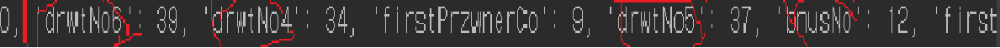
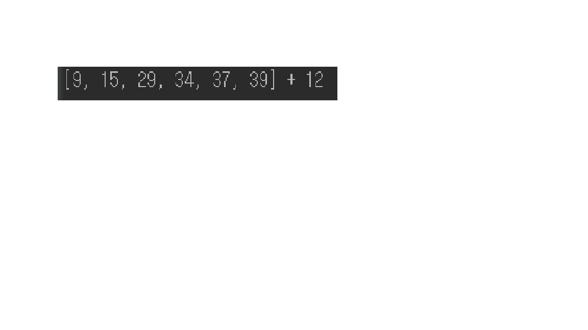

# 파이썬 로또 답안
### 0. 함수와 모듈?
문제 풀이를 시작하기 앞서 사용할 용어를 간단히 설명하겠습니다.    
(파이썬에 대해 잘 아시는 분들은 스킵하고 바로 문제풀이 부분을 보셔도 무방합니다)

먼저 `함수(function)`은 __일정한 작업을 수행하는 코드블럭을 의미하며, 보통 반복적으로 계속 사용되는 코드들을 함수로 정의하여 사용__ 하게 됩니다.  
이렇게 설명드리면 감이 잡히지 않는 분도 계실텐데요, 간단히 말해 구현하는데 여러 줄의 코드가 필요한 기능을 한 줄의 코드로 실행할 수 있게 만들어둔 것을 의미합니다. 
자주 사용할 기능을 함수로 만들어두면 편리하겠죠? 그리고 함수는 기능에 따라 필요한 데이터를 인자로 받기도 합니다.

다음으로 `모듈(module)`의 정의는, __파이썬 정의와 문장들을 담고 있는 파일. 달리 말하면 함수나 변수 또는 클래스를 모아 놓은 파일__ 입니다.  
이번 강의에서는 함수들의 모임, 즉 여러 기능을 쉽게 사용할 수 있게 모아둔 것으로 생각하시면 될 것 같습니다.  

이번 문제는 `random`이라는 모듈을 사용할 것입니다.
`random` 모듈은 이름에서도 알 수 있듯이 랜덤한 숫자, 난수 생성과 관련된 기능을 모아둔 모듈입니다. `random` 모듈 안에는 난수 생성과 관련된 다양한 기능이 함수로써 포함되어 있습니다.   
이번 과제와 안성맞춤인 모듈이라고 생각되지 않나요? :)  

자, 그럼 지금부터 본격적으로 문제풀이를 시작하겠습니다.  

### 1. 나만의 로또 번호 뽑기 
우리의 로또 번호를 뽑아보도록 합시다!  
첫 번째 목표는 1부터 45까지의 숫자 중 임의의 6개의 숫자, 로또 번호를 뽑아서 나타내는 것입니다.
앞서 말했듯이 `random` 모듈을 사용하도록 하겠습니다.  

모듈을 사용하기 위해선 먼저 해당 모듈을 가져올 필요가 있습니다.  
모듈을 가져올 때는 키워드 `import`를 사용합니다.
```
import random
``` 
이제 `random` 모듈의 다양한 함수를 사용할 수 있게 되었습니다.  
이중에서도 저희가 사용할 함수는 `random`의 `sample()` 입니다.  
`sample()`은 어떤 데이터의 집합으로부터 원하는 수만큼의 데이터를 샘플링할 수 있게 도와주는 함수입니다.
 

`sample()` 함수를 사용하려면 먼저 데이터의 집합을 생성해야겠죠?  
이번에는 `range()`함수를 사용해 1부터 45까지의 숫자를 'numbers'라는 이름의 변수에 저장해봅시다.  
`range()`함수는 따로 `module`을 import 할 필요 없는 내장 함수입니다.
다음과 같이 사용합니다.
```
range(start_num, stop_num)
# 2개의 인자, start_num 이상 stop_num '미만'의 숫자의 집합을 생성
```
우리가 필요한 것은 1부터 45까지의 숫자이므로,
```
numbers = range(1, 46)
```    
이로써 numbers라는 변수에 1부터 45까지의 숫자를 저장하였습니다.
 
모든 준비가 끝났습니다!  
이제 `sample()` 함수를 이용해 여러분의 로또를 뽑고 이를 표현해봅시다.
표현은 또 다른 내장함수인 `print()`함수를 사용하겠습니다.
다음 코드를 통해 `lotto`라는 변수에 여러분의 로또번호를 저장하고 이를 나타냅니다. 
 ```
lotto = random.sample(numbers, 6)
print(lotto)
 ``` 
여러분은 다음과 같이 화면에 나타난 자신의 로또 번호를 볼 수 있을 것입니다.  

 
 
로또 번호를 뽑는 데에는 성공했지만 크기에 상관 없이 뒤죽박죽 나열되어 있습니다.
숫자들이 크기 순서대로 정렬되면 좋겠죠?  
`sorted` 함수를 통해 숫자를 정렬해 봅시다. 
``` 
print(f'오늘의 행운의 로또는 {sorted(lotto)} 입나다')
```
다음과 같이 숫자들이 정렬되어 나타남을 확인할 수 있습니다.    

  

`sorted` 함수 말고 다른 방법으로도 `sort`라는 `메소드`를 사용해 리스트를 정렬할 수도 있습니다.    
(`메소드`란 함수의 일종으로 `클래스`의 함수를 뜻합니다.)    
이 둘의 차이점은 무엇일까요?  
다음 코드를 실행 시켜 봅시다.
```
print(f'오늘의 행운의 로또는 {lotto.sort()} 입니다') 
print(lotto)
```
첫 번째 줄에서는 로또번호 대신 `None`이, 두 번째 줄에서는 정렬된 로또 번호가 나옴을 알 수 있습니다.    

이제 차이점을 아시겠나요?  
+ `sort`의 경우는 어떤 값도 결과로서 반환하지 않습니다.   
이로 인해 로또 번호 대신 None이라는 값이 찍혀 나온 것입니다.   
대신 `sort`는 인자로 받은 리스트 자체를 정렬시켜줍니다.  
그래서 두 번째 줄에서 정렬된 로또 번호가 나온 것입니다.   
   
+ `sorted` 함수는 인자로 받은 리스트 자체는 변화시키지 않습니다.  
대신 새롭게 정렬된 리스트를 결과로서 반환해줍니다.  

### 2. 나는 몇등일까?
로또를 사기만 해서는 의미가 없죠!  
여러분의 로또 번호가 당첨되었는지 아닌지 그 여부를 살펴보도록 합시다.     
이번에는 파이썬에서 HTTP 요청을 보내는 용도로 쓰이는 `requests` 모듈을 사용할 것입니다.
`requests` 모듈은 내장되어 있지 않기 때문에 `pip`를 통해 설치해주어야 합니다.  
`명령 프롬프트(cmd)`에서 다음 명령어를 실행해 `requests` 모듈을 설치합니다.
```
pip3 install requests 
```

`requests`모듈을 이용해 복권사이트로부터 복권 정보를 받아옵니다.
`requests`모듈의 `get()` 함수를 이용합니다.  
이렇게 받아온 데이터는 문자열이나 딕셔너리의 형태로 저장이 가능합니다.  
본 예제에서는 이름이 `lotto`인 딕셔너리의 형태로 저장하겠습니다.
```
url = f"https://dhlottery.co.kr/common.do?method=getLottoNumber&drwNo=866"
response = requests.get(url)
lotto = response.json() # => dict
```
저장된 데이터를 출력해봅시다.
```
print(lotto)
```  

      

표시한 것처럼 6개의로또 번호는 drwtNO# 형태의 키로, 보너스 숫자는 bnusNo 키에 저장되어 있는 것을 알 수 있습니다.  
이제 당첨 번호를 보기 좋게 `winner`라는 변수에 담아 표현하겠습니다. 일단 `winner`란 이름의 빈 리스트를 만들어둡니다.
```
winner = []
```

간단한 for 문을 이용해 딕셔너리로부터 로또 번호를 추출하여 `a` 변수에 저장합니다.  
다음 코드는 `a`라는 빈 리스트에 n을 1부터 6까지 반복해 증가시키며 `lotto`딕셔너리의 `drwtNo{n}` 형태의 키의  `value`들을 저장한다는 뜻입니다.  
```
a = [lotto[f'drwtNo{n}'] for n in range(1, 7)]
```
보너스 번호도 `lotto` 딕셔너리로부터 뽑아내 `bonus`란 변수에 저장해봅시다.
```
bonus = lotto['bnusNo']
```

자 이제 마지막 단계입니다. 얻어낸 6자리의 당첨 로또 번호와 1개의 보너스 숫자를 `winner`라는 빈 리스트에
합쳐서 저장하고 출력해 우리가 뽑은 로또 번호와 비교해봅시다.
```
winner = f'{a} + {bonus}'
print(winner)
```
다음과 같이 출력됩니다.   



### 3. 내 등수 이쁘게 보여주자
__추가필요__
