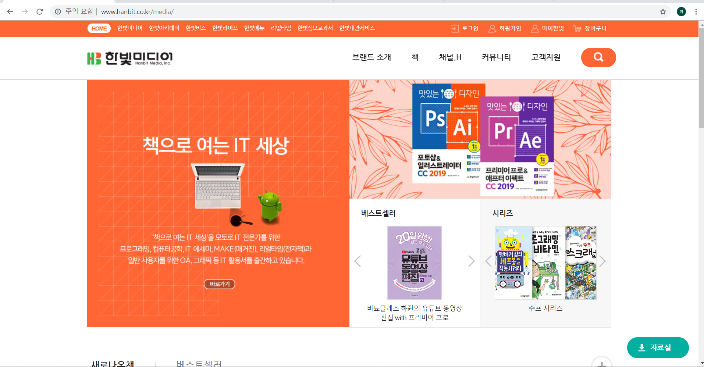
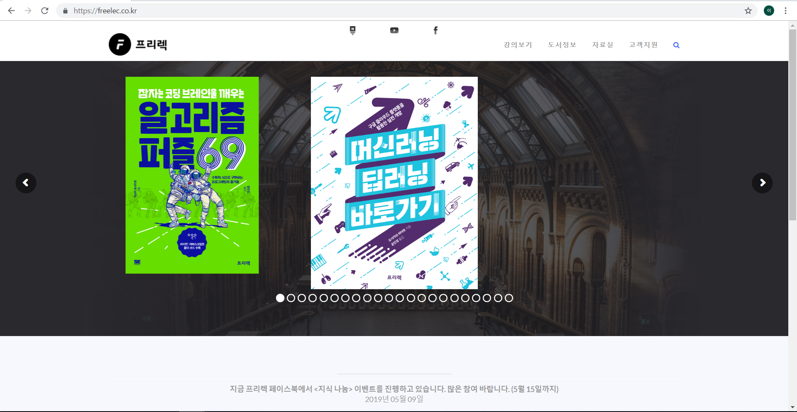
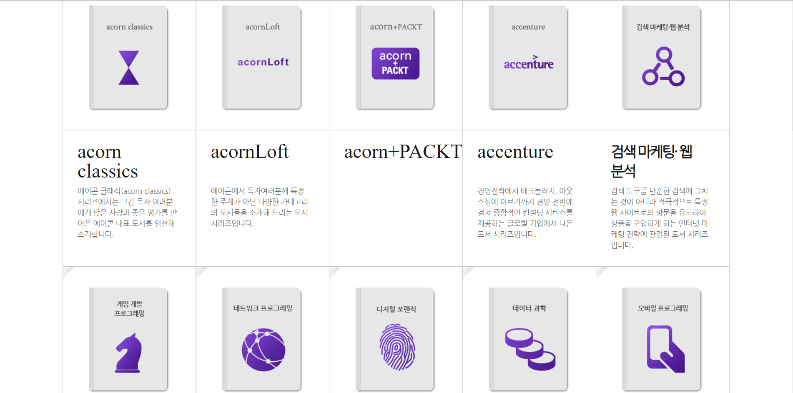
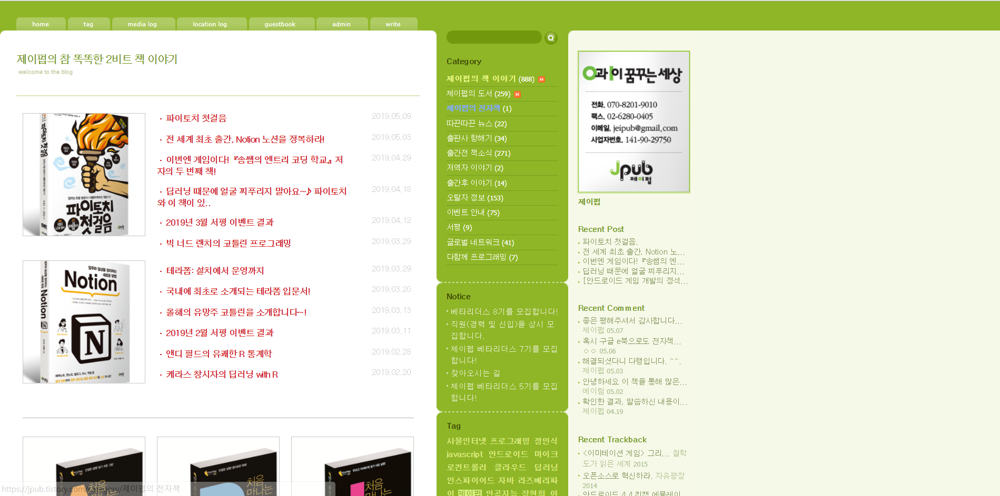
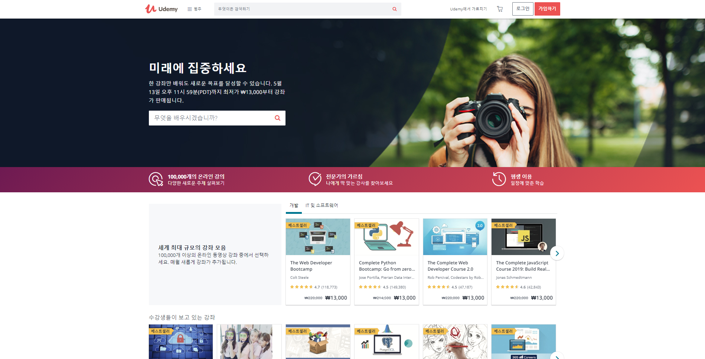
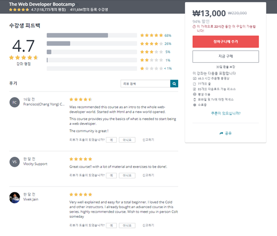

# 참고문헌 선정

## 1. 책(Book)

* 가장 기본적인 참고문헌에는 **책**이있다. 하지만 IT전문서와 활용서는 일반서점에서 팔지 않을수도 있기에 다음과 같은 사이트를 소개하다.

### (1) 한빛 미디어

* 브랜드 소개

**“책으로 여는 IT 세상”**

한빛미디어(주)는 ‘책으로 여는 IT 세.상’을 만들어 갑니다. IT 세상의 주역은 ‘우리’ 입니다. 한빛미디어(주)는 IT 세상의 주역들을 위한 프로그래밍, 컴퓨터공학, IT 에세이, Make, 리얼타임(전자책), OA, 그래픽, 나와 내 아이를 위한 실용 등 다양한 분야의 책으로 IT 세상을 만들어 가고 있습니다.

[한빛미디어 홈페이지](http://www.hanbit.co.kr/store/books/bestseller_list.html)

### (2) 프리렉(freelec)

* 프리렉은 책을 판매할 뿐만 아니라 유튜브,페이스북,네이버 포스트를 통해 최신 정보를 업데이트하고 강의를 들을수 있게 되어있다.

[프리렉 사이트](https://freelec.co.kr/)

[프리렉 유튜브](https://www.youtube.com/user/FREELECKOR)

[프리렉 페이스북](https://www.facebook.com/%ED%94%84%EB%A6%AC%EB%A0%89-%EC%B6%9C%ED%8C%90%EC%82%AC-freelec-509640889554399/)

[프리렉 네이버포스트](https://post.naver.com/my.nhn?memberNo=34865381)

### (3) 에이콘(acorn)

* 에이콘이 다른 출판사이트와 다른 점은 책을 여러가지 주제로 나누어서 정리를 해놓았기 때문에 자기가 원하는 주제의 책을 쉽게 찾을 수 있다는 것이다.

 [에이콘(acorn)](http://acornpub.co.kr/)

### (3) 제이펍(jpub)

* 다른 곳에 비해 딱히 좋은 특성은 없지만 제이펍이라는 출판 사이트도 존재한다.

[제이펍](https://jpub.tistory.com/)

**위의 사이트에서 책을 구매하여 강의자료에 쓰일 내용을 정리해 강의 자료를 만들 수 있다!!!**

## 2. 인터넷강의

### (1) Udemy

* Udemy는 100,000개의 다양한 주제의 강의를 가진 **세계 최대의 강좌 모음**입니다. 강사가 올린 강의를 확인하고, 미리보기와 리뷰를 통하여 구매할지 결정할수있습니다.

[Udemy 사이트](https://www.udemy.com/)

**아래와 같이 듣고싶은 강좌에 대한 리뷰를 확인할 수 있다.**

### (2) 생활코딩

* 생활코딩은 일반인들에게 프로그래밍을 알려주는 무료 온라인, 오프라인 수업입니다. 유튜브를 통하여 공부를 하고, 페이스북을 통하여 프로그래밍에 관한 지식을 다른 개발자들과 공유할 수 있습니다. 

[생활코딩 사이트](https://www.opentutorials.org/course/1)

[생활코딩 유튜브](http://www.youtube.com/user/egoing2)

[생활코딩 페이스북 그룹](http://goo.gl/BjjSh)

[생활코딩 페이스북 페이지](http://goo.gl/xsdUW)

* 생활코딩에서는 비정기적으로 오프라인 수업을 합니다. 3일 동안 웹서비스를 직접 만들어보는 수업입니다.  아래 링크에서 신청서를 작성하면 수업이 있을 시에 연락을 줍니다.

[오프라인 강의 신청](http://codingeverybody-notify.appspot.com)

## 3. 개발자 커뮤니티 사이트

* 개발자들이 주로 사용하는 커뮤니티 사이트는 크게 [Stackoverflow](https://stackoverflow.com/)와 [Quora](https://Quora.com/) 두가지가 있습니다. 이 사이트들은 프로그래밍을 하다가 에러가 발생했을때, 질문을 하고 답변을 받을 수 있는 사이트입니다. 

### (1) Stack Overflow

### (2) Quora

* 규모가 큰 사이트이니 만큼, 내가 겪은 에러에 대한 질문을 다른사람이 먼저 올렸을 가능성이 큽니다. 검색을 잘 활용하면 쉽게 에러 해결을 할 수 있을 것입니다.