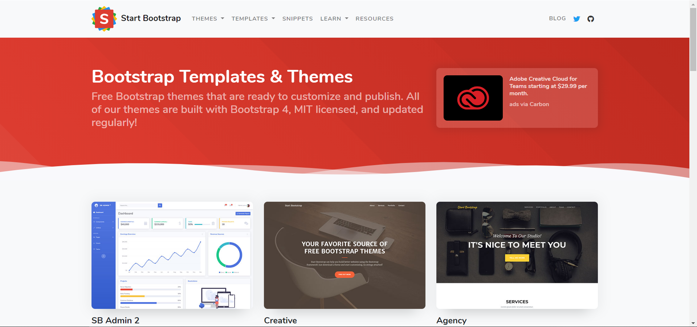
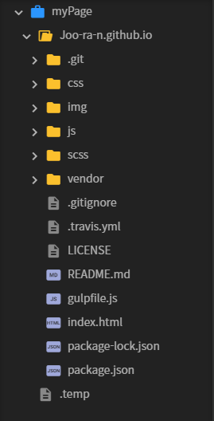

# 자기소개페이지 만들자

## ~나만의 페이지를 만들어 보자~
```
대충 목차가 들어갈 자리
```

## 1. 서론
우리는 인터넷을 사용하면서 많은 웹 페이지들을 봐 왔다. 구글, 네이버, 티스토리, 유튜브,~~폰..허..ㅂ..~~ 등 정말정말 많은 웹 페이지들이 있는데, 그 중에 내 페이지 하나 정도는 있어도 괜찮잖아?  
세상에서 제일 쉬운 페이지 만들기, 시작해 봅시다.

자아성찰부터 해보자면, 우리는 ~~개~~허접이다. 그래서 뭔가를 처음부터 만들 수가 없다! 이런 우리를 위해 누군가들이 만들어 놓은 것이 있으니, 그것이 바로 부트스트랩이다!  
[부트스트랩이란?(나무위키)](https://namu.wiki/w/Bootstrap%28%ED%94%84%EB%A0%88%EC%9E%84%EC%9B%8C%ED%81%AC%29)  
이 강에서는 구름IDE와 깃헙, 부트스트랩을 활용하여 기본적인 페이지를 만드는 법을 알아보기로 한다.

## 2. 본론
일단 Github에서 대충 repository를 만들고, 구름IDE에서도 대충 컨테이너를 하나 만들자.(대충이라고 적어놨지만 진짜로 대충 만들지는 말자)  
우리는 부트스트랩, 그 중에서도 무료인 것이 필요하므로 구글 검색창에 'bootstrap free template'이라고 검색해 보자. 그 중에 가장 위에 있는 페이지에 들어가면..  
  
위와 같이 여러 템플릿들이 있다. 이 중에 마음에 드는 템플릿을 다운로드하고(zip형태), 압축을 풀어서, 구름IDE 컨테이너에 업로드하자. 그러면 다음과 같이 뭔가가 쭈루룩 생길 것이다.  
  
저 목록 중 index.html 파일이 우리가 실제로 보는 페이지다! 저 파일을 열어서 페이지 제목, 안에 넣을 사진, 기타 레이아웃 등을 설정해 주면 된다.  


## 3. 결론
대충 결론 들어갈 자리